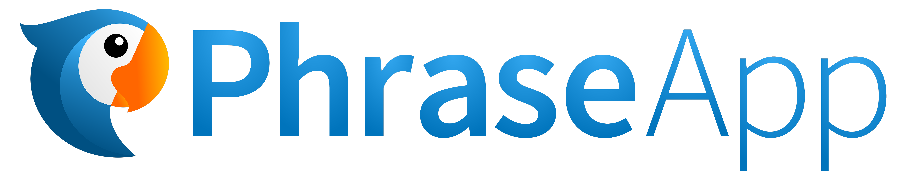
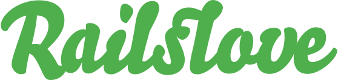
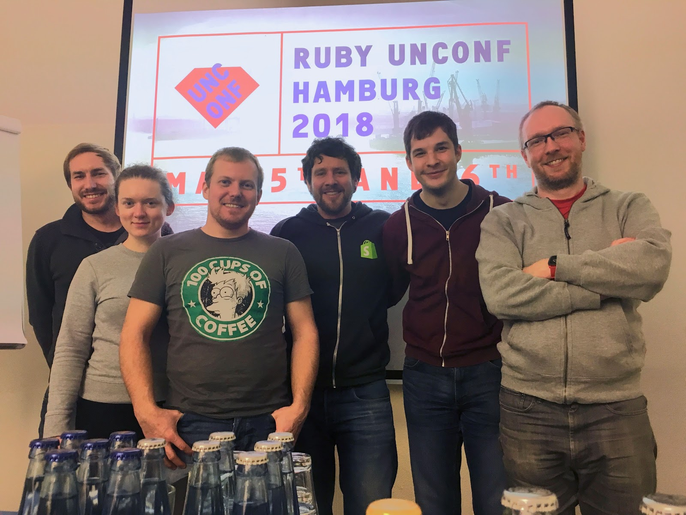
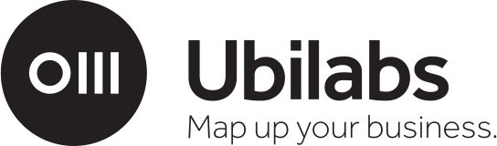
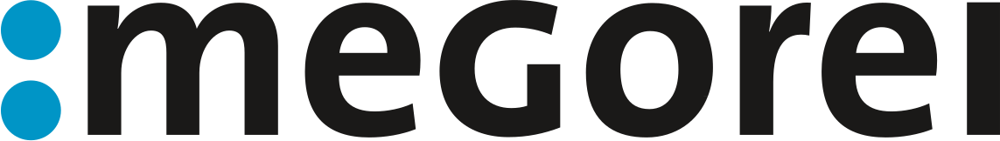
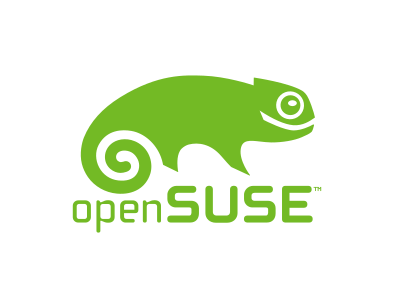
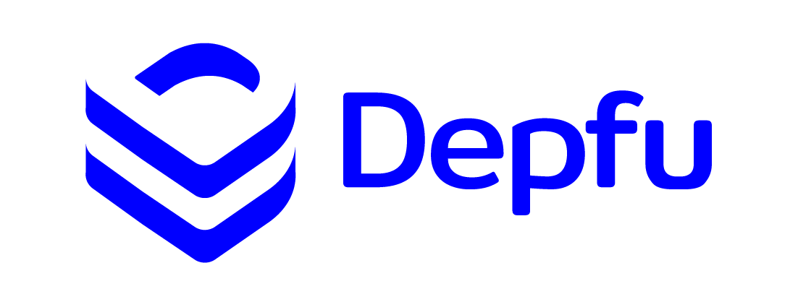
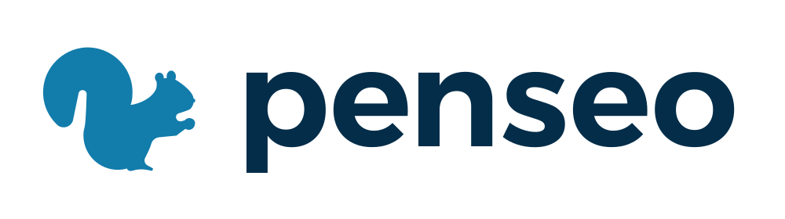

## Let's meet and talk about Ruby

Ruby Unconf Hamburg 2018 will happen on 5th and 6th of May 2018 at the HAW Hamburg, DMI Campus Finkenau.

You decide on the topics, talks and speakers. This is your conference.  
Give a talk, get inspired, code together, talk to people.

## Schedule

### Live schedule: **[Ruby Unconf Schedule](https://docs.google.com/spreadsheets/d/1SH3ujYbBMPPICPZTqR6A2vVUGvAnBAv5ZqdzWBKSOn4/edit#gid=0)**

## Agenda

<h3>Saturday</h3>
<table>
<tbody>
<tr>
<td class="schedule__time">08:30 - 09:30</td>
<td>Registration &amp; Breakfast</td>
</tr>
<tr>
<td class="schedule__time">09:30 - 09:45</td>
<td>Welcome</td>
</tr>
<tr>
<td class="schedule__time">09:45 - 11:00</td>
<td>Proposals &amp; Voting</td>
</tr>
<tr>
<td class="schedule__time">11:15 - 11:45</td>
<td>Keynote by <a href="http://tenderlovemaking.com/">@tenderlove</a></td>
</tr>
<tr>
<td class="schedule__time">12:15 - 12:45</td>
<td>Talk F1 | Talk H1</td>
</tr>
<tr>
<td class="schedule__time">13:00 - 13:30</td>
<td>Talk F2 | Talk H2</td>
</tr>
<tr>
<td class="schedule__time">13:30 - 14:30</td>
<td>Lunch</td>
</tr>
<tr>
<td class="schedule__time">14:30 - 15:00</td>
<td>Talk F3 | Talk H3</td>
</tr>
<tr>
<td class="schedule__time">15:15 - 15:45</td>
<td>Talk F4 | Talk H4</td>
</tr>
<tr>
<td class="schedule__time">15:45 - 16:30</td>
<td>Coffee &amp; Cake</td>
</tr>
<tr>
<td class="schedule__time">16:30 - 17:00</td>
<td>Talk F5 | Talk H5</td>
</tr>
<tr>
<td class="schedule__time">17:15 - 17:45</td>
<td>Talk F6 | Talk H6</td>
</tr>
<tr>
<td class="schedule__time">17:45 - 18:00</td>
<td>Family photo</td>
</tr>
<tr>
<td class="schedule__time">20:00</td>
<td>Party at <a href="https://goo.gl/maps/KU24FWDEfsD2">Bidges & Sons (Rooftop Bar)</a>
</td>
</tr>
</tbody>
</table>

<h3>Sunday</h3>
<table>
<tbody>
<tr>
<td class="schedule__time">09:00 - 10:00</td>
<td>Registration &amp; Breakfast</td>
</tr>
<tr>
<td class="schedule__time">10:00 - 11:30</td>
<td>Proposals &amp; Votings</td>
</tr>
<tr>
<td class="schedule__time">11:30 - 12:00</td>
<td>Talk F1 | Talk H1</td>
</tr>
<tr>
<td class="schedule__time">12:15 - 12:45</td>
<td>Talk F2 | Talk H2</td>
</tr>
<tr>
<td class="schedule__time">12:45 - 13:45</td>
<td>Lunch</td>
</tr>
<tr>
<td class="schedule__time">13:45 - 14:15</td>
<td>Talk F3 | Talk H3</td>
</tr>
<tr>
<td class="schedule__time">14:30 - 15:00</td>
<td>Talk F4 | Talk H4</td>
</tr>
<tr>
<td class="schedule__time">15:00 - 15:30</td>
<td>Coffee &amp; Cake</td>
</tr>
<tr>
<td class="schedule__time">15:30 - 16:15</td>
<td>Lightning Talks</td>
</tr>
<tr>
<td class="schedule__time">16:15 - 16:30</td>
<td>Closing</td>
</tr>
</tbody>
</table>

## Tickets

### with all tickets you gain access to both conference days as well as free food, drinks and entry to the party.

<a class="ticket" href="https://ti.to/ruby-unconf/2018">
  
<s>early bird</s>

  
sold out

  
<s>45,00€</s>

</a>

<a class="ticket" href="https://ti.to/ruby-unconf/2018">

regular

  

65,00€

</a>

<a class="ticket" href="https://ti.to/ruby-unconf/2018">

regular 

50% diversity support ❤️

95,50€

</a>

<a class="ticket" href="https://ti.to/ruby-unconf/2018">

regular

100% diversity support ❤️❤️

130,00€

</a>

Tickets are <a href="https://ti.to/ruby-unconf/2018">now available</a>.

If you are a university student or still go to school, or you're doing an apprenticeship ("Azubi") or anything similar (Put differently: We're using the broad english definition of "student") **and you cannot afford** the regular prices, we can offer you a [heavily discounted student ticket](https://ti.to/ruby-unconf/2018/with/jqzr4wop-am).

<em>You should be able to provide some form of proof of your student status, like a student id, or a letter of enrollment, or anything, really, during check in at the venue. If you are in doubt, feel free to [ask us via Email](mailto:info@rubyunconf.eu?subject=[Student+Tickets]).</em>

<!-- Follow <a href="https://twitter.com/RubyUnconfEU">RubyUnconfEU</a> on twitter to get notified on the next ticket batch releases. -->

## Diversity

Our scholarship program is meant to make Ruby Unconf a better unconference. We want to make this community-focused event accessible to the wide range of people who are learning, work with, or are Ruby enthusiasts. We welcome applicants from underrepresented groups in tech to apply. This includes, but is not limited to: women-identifying persons, people of color, LGBTQIA people, people with physical and mental disabilities and people facing economic and/or political hardships. Scholarship recipients will receive a Ruby Unconf Hamburg 2018 ticket.

Applications are now closed and we're looking forward to welcoming our scholarship recipients at Ruby Unconf 2018.

  
  
Platinum Sponsor

## Code Of Conduct

The heart of the Ruby Unconference is people. [This guideline](https://berlincodeofconduct.org/) is meant to support a happy, productive and safe event experience that can welcome new ideas and inspiration for all attendees. Regardless of gender, sexual orientation, age, ability, ethnicity, socioeconomic status, and religion (or lack thereof). We gain strength from diversity, and actively seek participation from those who enhance it.

Read the full [Berlin Code of Conduct here](https://berlincodeofconduct.org/).

### Violations / Care team

In case you feel in any way uncomfortable or threatened during the conference or you see a violation to the code of conduct happening, we'll have a permanent care team in place that you can approach and that also can be reached by:

- [email (care@rubyunconf.eu)](mailto:care@rubyunconf.eu)
- [phone (+49-176-98717841)](tel:+4917698717841) (Will only be monitored from Saturday the 5th to Sunday the 6th)
- [Anonymous form submission](/code-of-conduct-form.html)

## Unconf you say?

What exactly is an Unconference? It works like this: Everybody can propose a talk. Everybody votes for the talks they want to see. The most voted talks will be held. You decide what will happen!

**Read more: <a href="https://gist.github.com/robertkowalski/8b21484c517c54d9b80aeba1d43864c9">What is an Unconference</a>**

Do you want to propose a talk? Or are interested in a topic you want to hear about? Add your [Ideas to the list](https://contriboot.herokuapp.com).

<a href="https://contriboot.herokuapp.com" class="btn btn-primary">💡 Add your Idea 💡</a>

  
Gold Sponsors 

  

    
    
    
    
  

  

    
    
  

  

  [More about our sponsors!]({{site.baseurl}})
  

## Venue

We're hosted by the [Hamburg University of Applied Sciences, Faculty of Design, Media and Information](https://www.haw-hamburg.de/english/about-us/faculties-departments/design-media-information.html).

<iframe src="https://www.google.com/maps/embed?pb=!1m18!1m12!1m3!1d2369.3635298564614!2d10.031139751899804!3d53.56912837992829!2m3!1f0!2f0!3f0!3m2!1i1024!2i768!4f13.1!3m3!1m2!1s0x47b18ec9ad80408b%3A0x65298bd196908e49!2sHAW+Hamburg+-+Fakult%C3%A4t+DMI!5e0!3m2!1sde!2suk!4v1518718024833" width="100%" height="400" frameborder="0" style="border:0" allowfullscreen></iframe>

### Getting there

The easiest way to get there is by walking 500m from the U-Bahn (Underground) station "Mundsburg", which is about a 7 Minute ride away from the central station ("Hauptbahnhof").

It's probably not a good idea to try to go by car, as parking space is very limited and even on a saturday, we can't really recommend driving in Hamburgs inner city.

If you are arriving from Hamburg Airport, you should take the S-Bahn (Metro) to Barmbek and then the U-Bahn to Mundsburg.

### Surroundings

The Venue is right next to the Eilbekkanal, a channel that runs directly to the Alster lake ("Aussenalster") which is probably a 30 minute walk but especially worth it on a sunny spring day.

Next to the train station "Mundsburg" is one of Hamburgs largest shopping malls which includes a cinema (if you don't like partying on saturday night, for example) - Be warned though, all movies there are probably shown in german.

## Hamburg

Getting to Hamburg is easy - the Wikivoyage travel guide sums up everything you need to know about getting to and getting around Hamburg, finding a place to stay or even moving here: [Wikivoyage - Hamburg](https://en.wikivoyage.org/wiki/Hamburg)

If you are the first time in Hamburg we have some tipps for getting around here and what you should probably visit while being here. Having some days left before or after Ruby Unconf? [Hamburg is beautiful <3]({{site.baseurl}})

  

    
    
    
    
    
    
  

  
Silver Sponsors 

  
We are looking for more <a href="https://docs.google.com/document/d/1XvPizMM25vlZZWJpHCoMVsBfEngxdr18Y-8i6IPM1JA/edit#" target="_blank">sponsors</a>!

## Contact

Please contact our team at <a href="mailto:info@rubyunconf.eu">info@rubyunconf.eu</a> if you have
any questions, remarks or ideas.

  

    
    
    
    
    
    
  

  
Bronze Sponsors 

  
We are looking for more <a href="https://docs.google.com/document/d/1XvPizMM25vlZZWJpHCoMVsBfEngxdr18Y-8i6IPM1JA/edit#" target="_blank">sponsors</a>!

