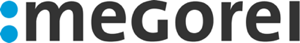

## Sponsors

Ruby Unconf Hamburg would not be possible without our sponsors. We are very thankful for their support.
 
Be sure to check them out!
We are looking for more <a href="https://docs.google.com/document/d/1XvPizMM25vlZZWJpHCoMVsBfEngxdr18Y-8i6IPM1JA/edit#" target="_blank">sponsors</a>!

## Platinum Sponsor
  

    
  

## Gold Sponsors

  

    
     
    ePages is one of the world’s most popular cloud solution for small and medium-sized online businesses. We live and breathe ecommerce.

    We focus on an ecosystem of microservices for our [highly scalable and flexible ecommerce platform](https://developer.epages.com/). The backend is based on Java, SpringBoot, Docker, and Kubernetes and is decoupled via a REST API from a ReactJS frontend. That’s how we tie an attractive package for our merchants to hit the ground running.
    And we are Ruby enthusiasts! For our in-house tools, such as provisioning, pricelist, or BI software, we rely on Ruby-based technology. Having the RubyUnconf in Hamburg is a home run for us.
  

  

    
  

  

    
  

## Silver Sponsors
  

    
  

  

    
  

  

    
  

  

    
  

## Bronze Sponsors
  

    
  

  

    
  

